# Dev Toolkit Web

This repository provides a comparison between `Claude Opus`, `Gemini CLI` and `GPT Codex` for Web App Generation.

# Details

The `main` branch provides a simple `Astro` application created using `npm create astro@latest` (v5.17.1). `React 19` and `Tailwind 4` were added (see src/package.json).

The `specs/ui` folder contains the UI requirements we're looking for the app that is going to be built using the models:

- animations.md: It provides a description of all the animations the app must support.
- color-palette.md: It gives the theme details for the app.
- main-design.png: It is the intended design for the app.

## main-design.png

<p>
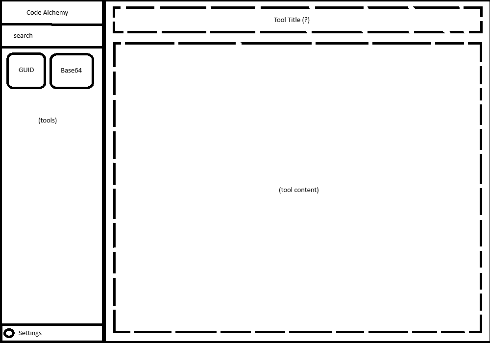
</p>

# Goal

Given the initial project configuration, the models must follow a prompt to create the first version of the app. The comparison will provide useful insights into their process and the resulting app.

# Models

The following models were tested:

- Gemini (gemini-2.5-pro, gemini-3-pro-preview, gemini-2.5-flash, and gemini-3-flash-preview) using CLI 0.28.2 in `Auto` mode
- Gemini (gemini-2.5-pro, and gemini-3-pro-preview) using CLI 0.28.2 in `Manual` mode
- Claude Opus 4.5
- Claude Opus 4.6
- GPT-5.2-Codex
- GPT-5.3-Codex

> Gemini CLI 0.28.2 Auto mode: Let Gemini CLI decide the best model for the task.

# Context

Guidelines to build the app were provided to all models through a context file. The content of the context file is the same for all models, but they are in different locations.

## Context for Gemini models

The file `GEMINI.md` was created to provide context to the Gemini models.

## Context for Claude Opus models

The file `.claude/CLAUDE.md` was created to provide context to the Claude Opus models.

## Context for GPT Codex models

The file `AGENTS.md` was created to provide context to the Codex models.

# Prompts and execution

The base prompt to generate the app is:

```md
Read the image `specs/ui/main-design.png` and create all necessary components to build the app that satisfy the design from the image. Then add two tools components, one for generating GUIDs and one for converting text/files into a base64. Add the tools to the app.
```

## Execution for Gemini models

Gemini CLI 0.28.2 was used to create the app using the Gemini models. When opening the CLI in the project, it automatically reads the GEMINI.md file. The base prompt was provided without any modifications.

## Execution for Claude Opus models

`GitHub Copilot Chat` + `Visual Studio Code` were used to create the app using the Claude Opus models. The base prompt was updated to indicate where the context file is.

```md
I added a context file for you in .claude/CLAUDE.md. This is your task: Read the image specs/ui/main-design.png and create all necessary components to build the app that satisfy the design from the image. Then add two tools components, one for generating GUIDs and one for converting text/files into a base64. Add the tools to the app.
```

## Execution for GPT Codex models

`GitHub Copilot Chat` + `Visual Studio Code` were used to create the app using the GPT Codex models. Just like with Claude, the base prompt was updated to indicate where the context file is.

```md
I added a context file for you in the `AGENTS.md` file. This is your task: Read the image specs/ui/main-design.png and create all necessary components to build the app that satisfy the design from the image. Then add two tools components, one for generating GUIDs and one for converting text/files into a base64. Add the tools to the app.
```

## Additional notes

There was not detailed iconography requirements other than those described in `specs/ui/animations.md`. This was intended to see how the models figured this out.

Images are better to describe user interfaces, that's the reason why the prompt uses the `specs/ui/main-design.png` file to express the desired UI for the app.

# In-Process results

These are interesting results observed during the execution of each model.

## Gemini (gemini-2.5-pro, gemini-3-pro-preview, gemini-2.5-flash, and gemini-3-flash-preview) using CLI in Auto mode

- `styled components` was used for styling instead of `Tailwind` 🥲
- There was an error in the `Ripple` component created by the model. The app could not load due to this error. I asked the model to fix the issue which was related to `styled components`.
- The model was able to resolve the issue by removing `styled components` and fully using `Tailwind`.
- Gemini CLI was not able to run the app and fix the issue automatically. I had to manually run `npm run dev` to start the app, get the `Stack Trace` error, and provide it to the CLI.
- After some manual iterations, the issue was fixed.
- The model asked several times for user confirmation to execute some actions like creating files or running commands.
- The development timeline for the app was extended due to the issue, resulting in a slower delivery compared to previous models.
- Quota usage decreased around ~33% from the daily usage for both pro models.

<p>
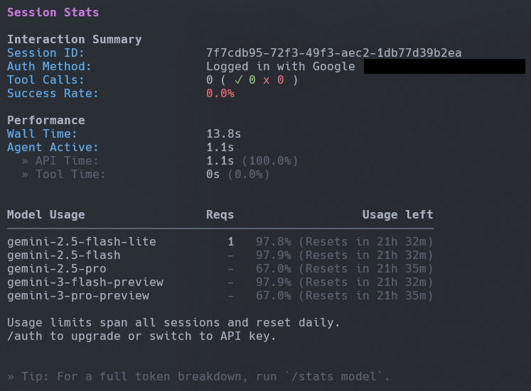
</p>

## Gemini (gemini-2.5-pro, and gemini-3-pro-preview) using CLI in Manual mode

- Quota usage decreased around ~66% from the daily usage for both pro models. This is specially important compared to the quota usage in `Auto mode`.
- The model could not finished the task due to quota usage.
- The model asked several times for user confirmation to execute some actions like creating files or running commands.
- Although the `Manual mode` was configured to use pro models only, it used 0.3% of the flash models.
- The model created `.astro` files for the components, it couldn't infer that `React` was a better choice given the `Tech Stack` from the context file.
- Incredibly, the model behave worst compared to the `Auto mode`.
- It took more than 10 minutes, and it could not finish the app.

<p>
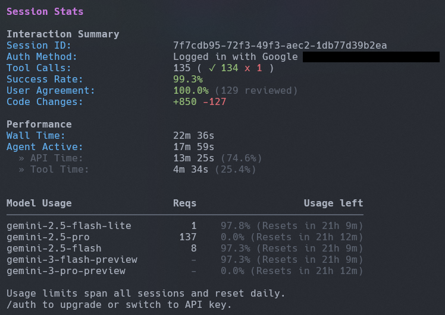
</p>

## Claude Opus 4.5

- No problems found during the execution. It was able to read the design from the `.png` file.
- Smooth execution overall, it asked me for permissions to execute some commands.
- There were some errors that were automatically fixed by the model.
- The time to execute the task was moderate.

## Claude Opus 4.6

- It was able to read the design from the `.png` file.
- Smooth execution.
- Speed felt better compared to `4.5` version.

## GPT 5.2 Codex

- It could not read the `specs/ui/main-design.png` file. The model asked for a text description of the design. I used the next text to describe the expected design based on the `.png` file:

```md
This is a web application dashboard layout with a vertical left sidebar and a large main content area to the right.

The left sidebar contains a list of tools. There are multiple horizontal square icons stacked vertically representing tool buttons. There's a maximum of two horizontal squares.

Above the main area at the top-left is a search input.

The main content area has the title of the selected tool from the sidebar. Below the title is the content that belongs to the selected tool
```

- The time from start to finish was moderate.
- There were some errors that were automatically fixed by the model.

## GPT 5.3 Codex

- Just like its predecessor, it could not read the file. However, the model figured this out by creating a python script, and it asked me for permissions to execute it.
- There were some errors that were automatically fixed by the model.
- To my surprise, this was the fastest model. The task was done in around 1 minute, it asked me for permission a couple times to execute some commands.

# App results

This is the funny part. Enjoy the results.

## Gemini (gemini-2.5-pro, gemini-3-pro-preview, gemini-2.5-flash, and gemini-3-flash-preview) using CLI in Auto mode

Branch: [initial-app-gemini-cli](https://github.com/itonx/dev-toolkit-web/tree/initial-app-gemini-cli)

<p>
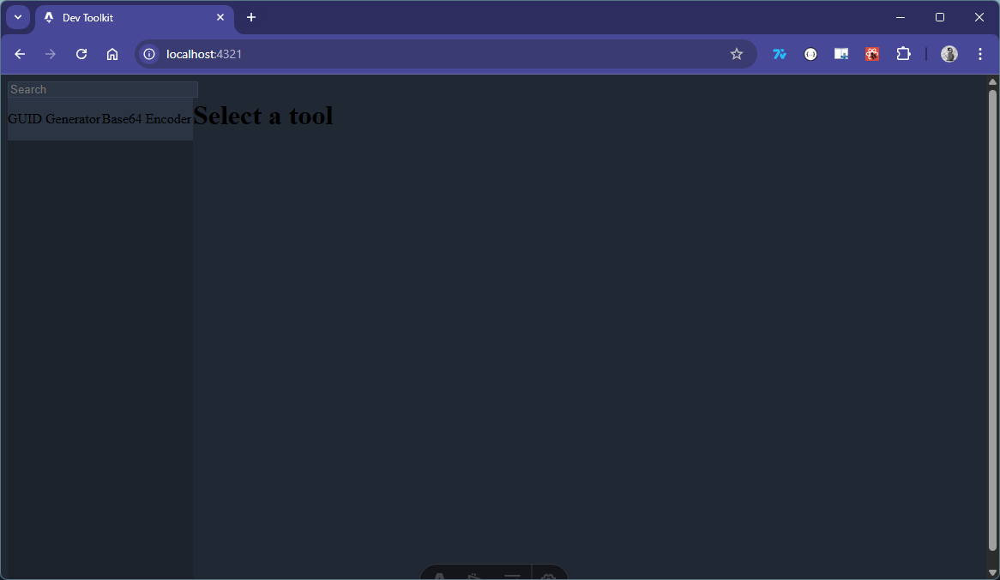
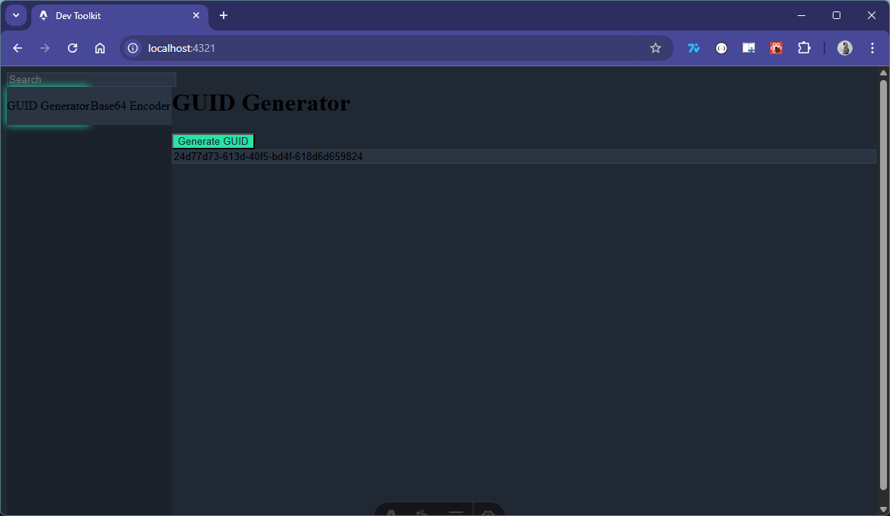
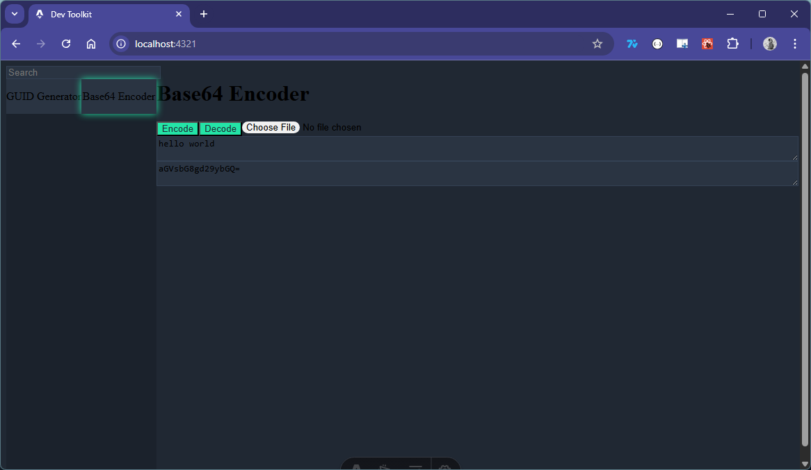
</p>

## Gemini (gemini-2.5-pro, and gemini-3-pro-preview) using CLI in Manual mode

Branch: [initial-app-gemini-cli-pro-only](https://github.com/itonx/dev-toolkit-web/tree/initial-app-gemini-cli-pro-only)

Consider the model consumed the remaining 2/3 of the daily quota, following an initial consumption of 1/3 under the previous configuration.

<p>
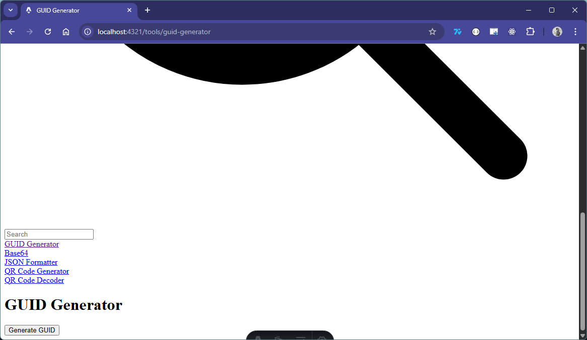
</p>

## Claude Opus 4.5

Branch: [initial-app-claude](https://github.com/itonx/dev-toolkit-web/tree/initial-app-claude)

<p>
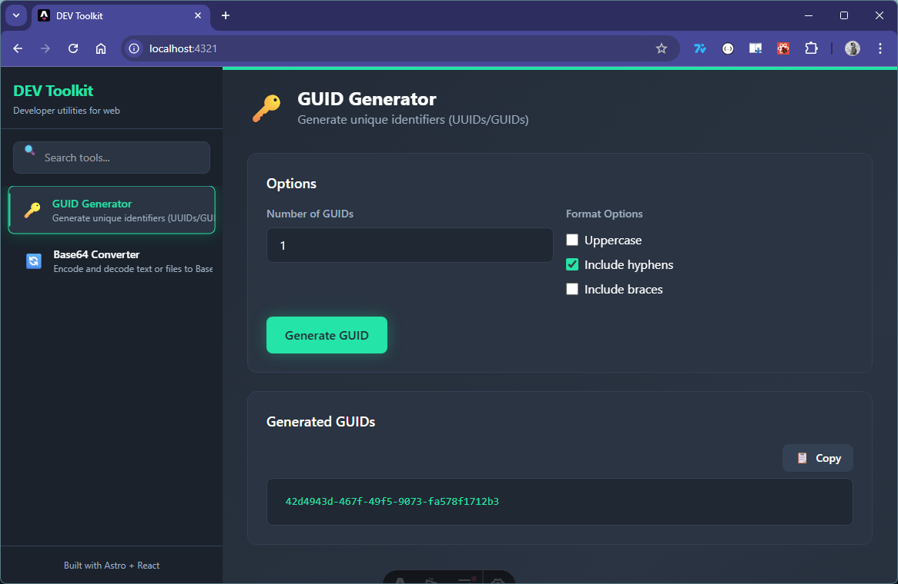
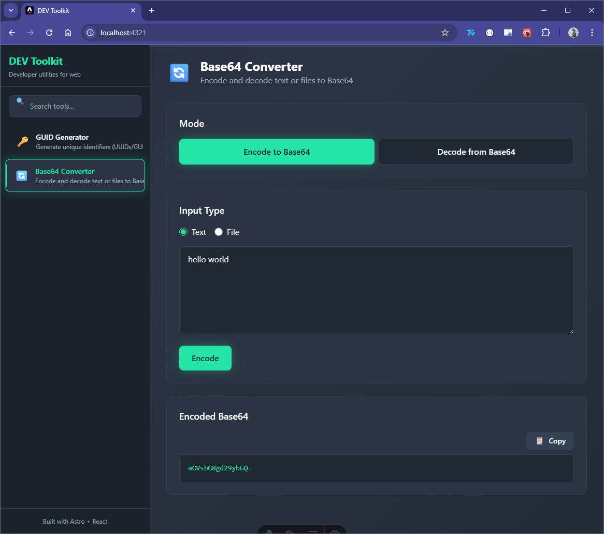
</p>

## Claude Opus 4.6

Branch: [initial-app-gpt-codexs-5.2](https://github.com/itonx/dev-toolkit-web/tree/initial-app-gpt-codexs-5.2)

<p>
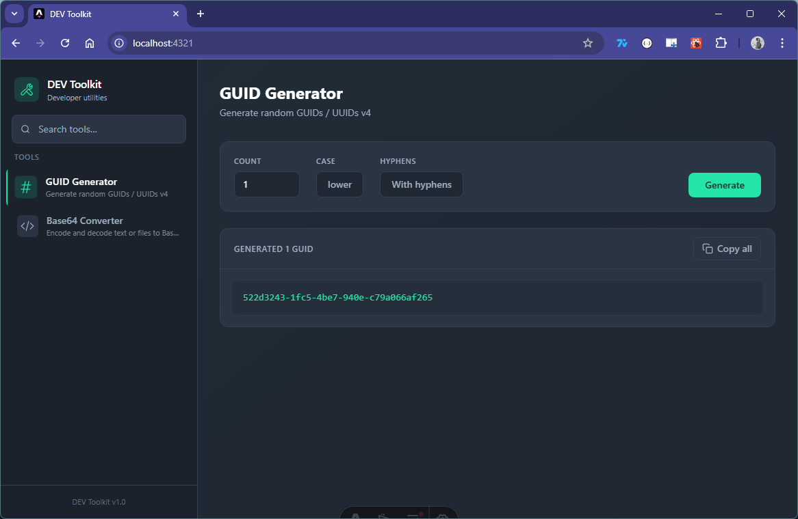
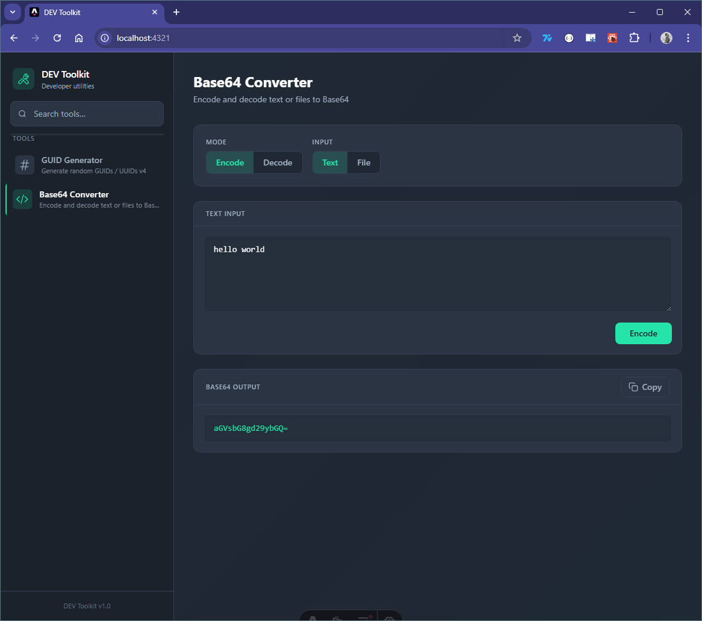
</p>

## GPT 5.2 Codex

Branch: [initial-app-gpt-codexs-5.2](https://github.com/itonx/dev-toolkit-web/tree/initial-app-gpt-codexs-5.2)

<p>
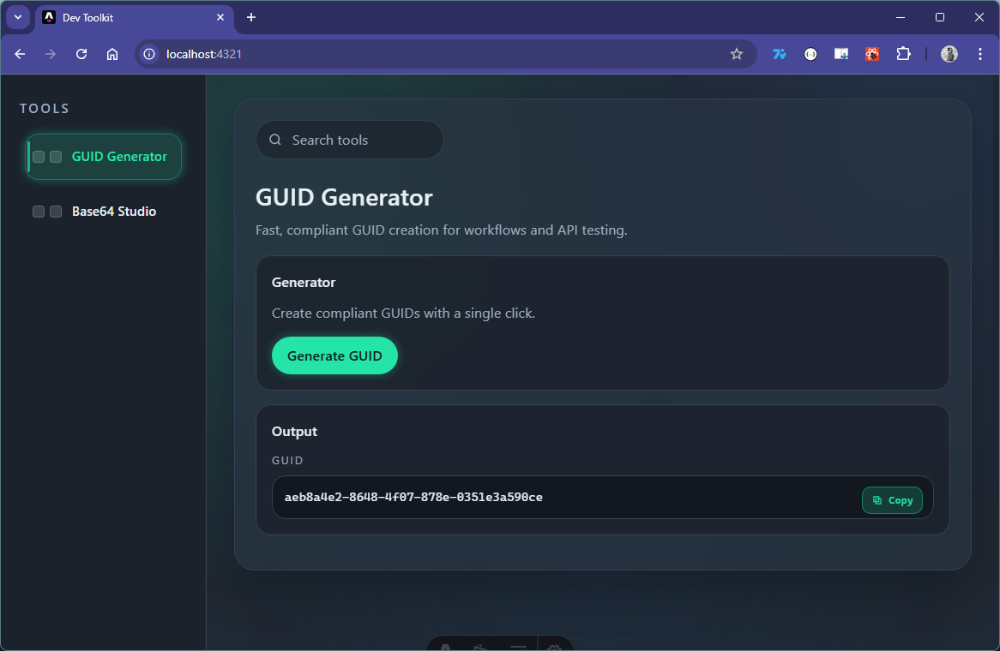
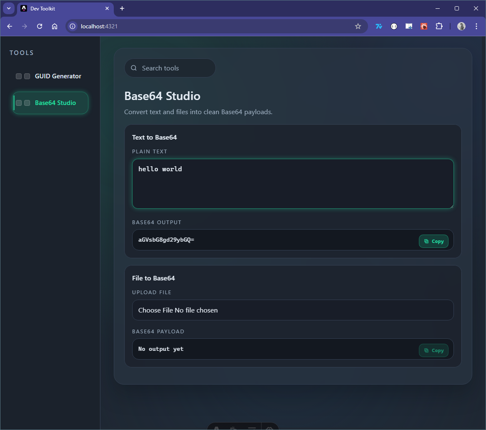
</p>

## GPT 5.3 Codex

Branch: [initial-app-gpt-codex-5.3](https://github.com/itonx/dev-toolkit-web/tree/initial-app-gpt-codex-5.3)

<p>
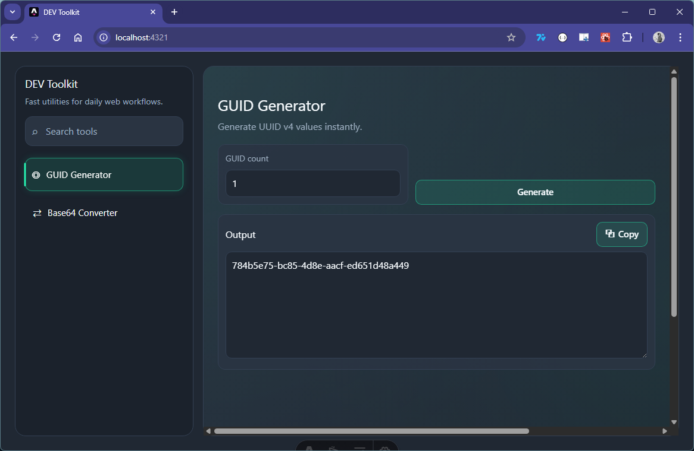
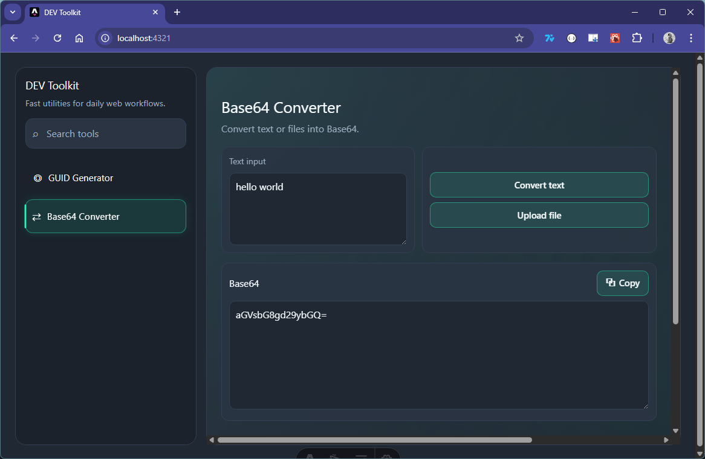
</p>

# Code Review

https://github.com/itonx/dev-toolkit-web/pulls
